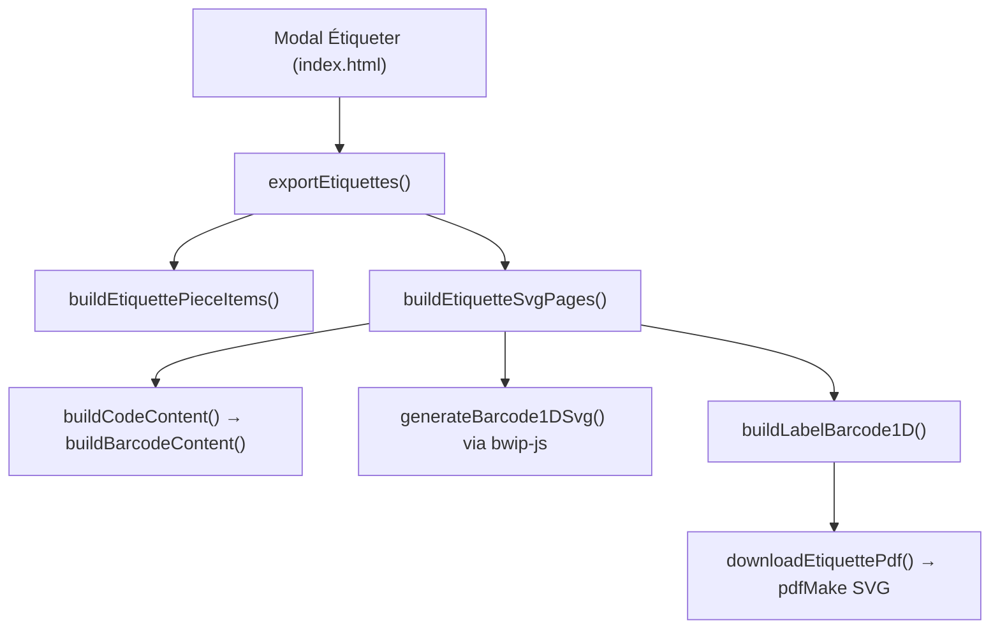

# Étiquettes Code 128 — inventaire du code de mise en forme

Document de référence pour le format **Code-barres 1D (Code 128)** dans VALOBOIS : étiquette physique **40×60 mm** (portrait), bandeaux colorés + panneau blanc 30×50 mm.

**Mockup de référence officiel :** `~/Desktop/valobois/valobois_final/exemple_complémentaire.pdf`  
Disposition **portrait / colonnes pivotées −90°** (pas de texte horizontal dans le panneau blanc).

> **Fichier central :** `js/app/valobois-app.js` — quasi tout le layout est là. Pas de patch dédié, pas de CSS pour le rendu PDF (seulement la modale UI).

---

## Vue d'ensemble du flux

```
Modal Étiqueter (index.html)
    → exportEtiquettes()
    → buildEtiquettePieceItems()          (données affichées)
    → buildEtiquetteSvgPages()
        → buildCodeContent() → buildBarcodeContent()   (contenu encodé)
        → generateBarcode1DSvg() via bwip-js           (SVG barres)
        → buildLabelBarcode1D()                        (layout SVG)
    → downloadEtiquettePdf() → pdfMake
```



---

## 1. Chaîne d'export PDF

| Rôle | Fonction | Lignes (`valobois-app.js`) |
|------|----------|----------------------------|
| Entrée utilisateur | `exportEtiquettes()` | ~43452 |
| Assemblage SVG multi-pages | `buildEtiquetteSvgPages()` | ~43593 |
| Conversion SVG → PDF | `downloadEtiquettePdf()` | ~43547 |
| Routage format | `buildLabel()` → si `qrData.mode === 'barcode1d'` | ~44256–44258 |
| **Cœur layout Code 128** | `buildLabelBarcode1D()` | ~44064–44254 |

---

## 2. Données affichées sur l'étiquette

| Rôle | Fonction | Lignes |
|------|----------|--------|
| Objet `item` (lot, essence, dimensions, orientation…) | `buildEtiquettePieceItems()` | ~43157 |
| Dimensions bandeau latéral (`mainDimensionLabel`) | `formatEtiquetteMainDimension()` | ~42944 |
| Découpage « Pièce » / « N° 12 » | `formatEtiquettePieceHeading()` | ~42996 |
| Volume bandeau droit | `formatOneDecimal()` local dans `buildEtiquetteSvgPages` | ~43919 |
| Couleurs orientation | `getPdfOrientationSummary()` (via `buildEtiquettePieceItems`) + map `OC` | ~43930 |

**Champs utilisés par `buildLabelBarcode1D` :**

- `lotRef`, `mainDimensionLabel`, `volumeLot`
- `typePiece`, `essenceNomCommun`, `origine`
- `pieceLabel` / `pieceHeading` (nameLabel, numberLabel)
- `orientationCode` / `orientationLabel`
- `uid` (fallback numéro pièce)

---

## 3. Contenu encodé dans le code-barres (HRI)

| Rôle | Fonction | Lignes |
|------|----------|--------|
| Route formula → contenu | `buildCodeContent()` | ~42825 |
| Chaîne Code 128 | `buildBarcodeContent()` | ~41595 |
| Limite 48 car. / warning 36 | `getCodeFormulaMaxLength()` / `getCodeFormulaWarnLength()` | ~41768 |
| Normalisation formula | `normalizeCodeFormula()` | ~41756 |
| Pas de normalisation 2D pour 1D | `getCodePayloadForEncoding()` | ~41802 |
| Génération SVG bwip-js | `generateBarcode1DSvg()` | ~42887 |
| Route générique | `generateCodeSvg()` | ~42937 |

**Paramètres bwip-js actuels** (`generateBarcode1DSvg`, ~42894) :

| Paramètre | Valeur |
|-----------|--------|
| `bcid` | `'code128'` |
| `scale` | `5` |
| `height` | `30` (barres plus épaisses pour zone 9×46 mm) |
| `rotate` | `'L'` |
| `includetext` | `false` |
| `backgroundcolor` | `'FFFFFF'` |
| `barcolor` | `'000000'` |
| `paddingwidth` / `paddingheight` | `0` |

Le texte **HRI** (Human Readable Interpretation) sous le code-barres = `qrData.encodePayload || qrData.payload` (même chaîne encodée).

---

## 4. Grille page (A4/A3, placement des étiquettes)

| Rôle | Fonction | Lignes |
|------|----------|--------|
| Preset 40×60 mm | `getEtiquetteLayoutPreset()` | ~43275 |
| Calcul COLS/ROWS, marges, traits pointillés | dans `buildEtiquetteSvgPages()` | ~43665–44516 |

**Presets :**

| Mode | Page | Grille | Étiquette |
|------|------|--------|-----------|
| A4 paysage | 297×210 mm | 6×3 | 40×60 mm |
| A3 paysage | 420×297 mm | 9×4 | 40×60 mm |
| Gap | — | 2 mm | — |
| Marge | — | 11 mm | — |

Pour Code 128 : **40×60 mm** (pas le mode large 60×60 réservé au QR/DataMatrix « large »).

---

## 5. Helpers SVG (dans `buildEtiquetteSvgPages`)

Définis localement ~43682–43854 :

| Helper | Rôle pour Code 128 |
|--------|-------------------|
| `drawRotatedLineInCell()` | **Texte vertical** : ligne entière pivotée −90°/90° dans une cellule + `clipPath` |
| `drawVerticalRlInBox()` | Alias → `drawRotatedLineInCell` angle −90 |
| `drawRotatedCenterText()` | Texte pivoté sans clip cellule (utilisé ailleurs) |
| `drawCenteredInBox()` | Lot (bandeau haut), orientation (bandeau bas) |
| `fitSingleLineFont()` | Réduction typo si texte trop long |
| `buildQrVectorGroup()` | Insertion SVG code-barres, mode **`slice`** |
| `e()` | Échappement XML |

**Constantes typo/couleurs** (~43930–43935) :

```javascript
const OC = {
  reemploi: '#009E73',
  reutilisation: '#56B4E9',
  recyclage: '#E69F00',
  combustion: '#D55E00',
  none: '#CCCCCC'
};

const FF = 'Roboto,Arial,sans-serif';
const baseF = { lot: 2.5, side: 2.45, orientation: 2.8, piece: 2.5, line: 2.1, origin: 1.55 };
const C  = { dark: '#111111', mid: '#333333', muted: '#555555', light: '#777777' };
```

---

## 6. `buildLabelBarcode1D()` — layout draw.io

### Échelle

```javascript
const layoutScale = Math.min(LABEL_W / 40, LABEL_H / 60);
const su = (value) => value * layoutScale;
```

### Structure physique

| Élément | Dimensions |
|---------|------------|
| Étiquette totale | 40×60 mm |
| Bandeau haut (Lot) | 5 mm |
| Bandeau bas (Orientation) | 5 mm |
| Bandeaux latéraux (dimensions / volume) | 5 mm chacun |
| Panneau blanc central | 30×50 mm |

### Grille `COL` (mm, origine = coin haut-gauche du panneau blanc)

**Placement par `drawCol(texte, vCentre, uAncre, font, opts)`** — `v` = position horizontale (centre de colonne, 0–30), `u` = ancre verticale. `anchor: 'start'` étend le texte vers le haut depuis `uAncre` (bottom-alignement). Coordonnées calibrées sur les bbox réelles extraites de `exemple_complémentaire.pdf` (PyMuPDF).

| Champ | v centre | u ancre | font (mm) | anchor | Notes |
|-------|----------|---------|-----------|--------|-------|
| barres | 0–13 (cellule) | 1–49 | — | — | `slice`, pleine hauteur |
| `hri` | 15 | 47.5 | 1.85 | start | s'étend vers le haut |
| `type` (Solive) | 19 | 31 | 2.5 | start | bottom-aligné u=31 |
| `essence` | 22.5 | 31 | 2.2 | start | bottom-aligné u=31 |
| `origin` l.1 | 25.5 | 31 | 1.85 | start | #555 |
| `origin` l.2 | 28.5 | 31 | 1.85 | start | #555 |
| `num` (grand) | 26 | 39.5 | 5.9 | middle | centré |
| `piece` | 19.5 | 49 | 2.2 | start | bas-gauche |
| `nprefix` (N°) | 27 | 49.5 | 3.2 | start | bas-droite |

### Bandeaux latéraux

| Côté | Contenu | Angle | Typo (mm) |
|------|---------|-------|-----------|
| Gauche | `mainDimensionLabel` | −90° | 2.8 |
| Droite | Volume lot (`X,X m³`) | +90° | 3.72 |

### Bandeaux horizontaux

| Position | Contenu | Typo |
|----------|---------|------|
| Haut | `lotRef` (préfixe « Lot » si absent) | `baseF.lot` = 2.5 mm |
| Bas | `orientationLabel` en majuscules | `baseF.orientation` = 2.8 mm |

### Code-barres dans la zone `bar`

- Clip sur `COL.bar`
- `buildQrVectorGroup(svg, x, y, w, 'slice', h)` — remplit la zone, rogne l'excédent

### Référence typo 2D

Les tailles `baseF.lot` et `baseF.orientation` viennent du format QR 2D standard (`buildLabel` ~44267+). Les autres tailles sont calibrées pour reproduire draw.io tout en restant cohérentes avec le 2D.

---

## 7. Schéma visuel (disposition cible)

```
┌──────────────────────── 40 mm ────────────────────────┐
│ Lot nnn                    (bandeau haut 5 mm)          │ 60
├──┬──────────────────────────────────────────────┬─────┤ mm
│D │ [barcode 11mm][HRI 3mm][type][ess][orig]     │ vol │
│i │                              [piece][N°][num]│     │
│m │         panneau blanc 30×50                  │     │
│5 │         textes pivotés −90°                  │ 5mm │
│m │                                              │     │
├──┴──────────────────────────────────────────────┴─────┤
│              ORIENTATION (bandeau bas 5 mm)           │
└───────────────────────────────────────────────────────┘
```

**Mockups draw.io de référence :**

- `etiquette_code_barres.html` — disposition portrait (gauche) = **cible actuelle**
- `etiquette_code_barres_2.html` — compare portrait (gauche) vs paysage (droite, texte horizontal)

---

## 8. Fichiers périphériques

| Fichier | Rôle |
|---------|------|
| `index.html` ~5342 | Bouton formula `data-formula="barcode1d"` dans la modale Étiqueter |
| `lib/bwip-js-min.js` | Génération SVG Code 128 |
| `js/i18n/valobois-locales-editor.js` | Libellés `formulaBarcode1D` / `formulaBarcode1DDesc` |
| `css/main.css` ~11821 | Styles modale `.code-formula-*` (UI seulement) |
| CDN pdfMake (dans `index.html`) | Rendu final PDF depuis SVG |

### Non impliqués dans le layout Code 128

- `buildLabel2D` / `buildLabel2DLarge` — formats QR/DataMatrix
- Patches `*-patch.js` — disponibilité champs barcode composer, pas le rendu PDF
- Aucun fichier CSS pour le SVG étiquette

---

## 9. Points de vigilance

1. **Un seul endroit à modifier pour le layout** : `buildLabelBarcode1D()` + helpers dans `buildEtiquetteSvgPages()`.
2. **Typo partagée avec le 2D** via `baseF`, `FF`, `OC`, `C` — modifier ces constantes impacte aussi QR/DataMatrix.
3. **Texte vertical (panneau blanc)** : `drawCol` → `<text transform="translate() rotate(-90)">` (colonnes pivotées −90°, calibrées sur `exemple_complémentaire.pdf`).
3bis. **Centrage dans les bandeaux** : `drawCenteredInBox` et `drawRotatedCenterText` utilisent `dominant-baseline="middle"` (honoré par pdfMake) pour centrer verticalement. Helpers partagés → tous les formats (Code 128, 2D, 2D large) en profitent.
4. **pdfMake / svg-to-pdfkit** : pas de `<foreignObject>` ni `<switch>` — filtrés dans `stripUnsupportedSvgMarkup()` avant insertion du code-barres.
5. **Réduction typo** : `fitSingleLineFont` estime la largeur en mm (`longueur × taille × 0.58`) et descend jusqu'à `minFontSize` bas (plus de troncature visuelle par clip seul).
6. **Disposition paysage** (mockup draw.io droite) : **non implémentée**.
7. **Limites Code 128** : 48 caractères max, warning à 36.

---

## 9bis. Corrections appliquées (grille sans collision)

| Problème | Correction |
|----------|------------|
| Chevauchement piece / hri | `piece` déplacé en zone basse (`u ≥ 33.5`), `hri` réduit à v 11–13.5 |
| Collision num / origin | `origin` limité à `u ≤ 32.5`, `num` en zone basse |
| Troncature clip + typo | `fitSingleLineFont` plus conservateur, `minFontSize` abaissés |
| « Text is not SVG » | Strip `foreignObject` / `switch` dans `buildQrVectorGroup` |
| Numéro pièce | Priorité `pieceHeading` → `sourcePieceIndex + 1` → uid |

---

## 10. Historique des problèmes rencontrés

| Problème | Cause probable | État |
|----------|----------------|------|
| Code-barres trop petit / mauvaise orientation | Paramètres bwip + zone `COL.bar` | Corrigé (`rotate: 'L'`, `slice`) |
| Textes horizontaux ou mal positionnés | Grille `COL` vs draw.io | Grille draw.io en place |
| `transform rotate(-90)` sur `<text>` seul | pdfMake interprète mal | Remplacé par `<g transform>` |
| Empilement caractère par caractère | tspans verticaux | Remplacé par `drawRotatedLineInCell` |
| Bandeaux permutés à 90° | Mauvaise application des transforms | À re-valider en PDF |

---

## 11. Commandes utiles

```bash
# Servir l'app (obligatoire — pas file://)
python3 -m http.server 8080
# puis http://localhost:8080/index.html

# Vérifier la syntaxe JS
node --check js/app/valobois-app.js

# Build standalone (optionnel)
npm run build:standalone
```

---

## 12. Pistes d'évolution

- [ ] Re-export PDF et validation visuelle vs mockup gauche
- [ ] Ajuster positions mm `COL` si décalages résiduels
- [ ] Option disposition **paysage** (mockup droite) si besoin métier
- [ ] Alternative si pdfMake ignore `<g transform rotate>` : paths, raster canvas, ou disposition horizontale
